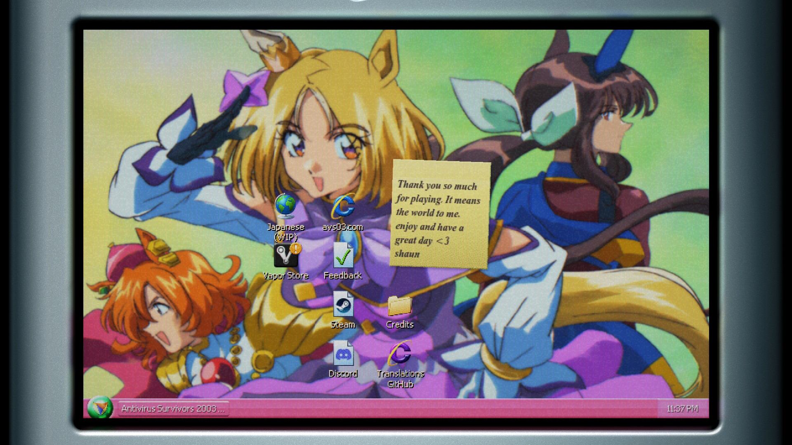

# VPP Wallpapers / Обои для VPP

A mod for **Antivirus Survivors 2003 Professional** that allows you to load custom wallpapers into the game.

Мод для **Antivirus Survivors 2003 Professional**, позволяющий загружать собственные обои в игру.

<p align="center">
  
</p>

---

## 📋 Requirements

- **GDPatch** installed ([Installation Guide](https://gdpatch.dev/using/install/))

---

## 🚀 Installation

1. **Install GDPatch** if you haven't already:
   - Follow the official guide: https://gdpatch.dev/using/install/

2. **Launch the game once and exit**
   - This initializes the GDPatch mods folder

3. **Download and install the mod:**
   - Download `vpp_wallpapers` mod
   - Extract the `vpp_wallpapers` folder into `GDPatch\mods\`

4. **Add your custom wallpapers:**
   - Navigate to: `GDPatch\mods\vpp_wallpapers\data\gdpatch\mods\vpp_wallpapers\wallpaper\`
   - Copy your PNG images into this folder
   - **Recommended resolution:** 786×480
   - **File names:** Use names without spaces (e.g., `my_wallpaper.png` instead of `my wallpaper.png`)

5. **Launch the game:**
   - Your custom wallpapers will appear in the Personalization menu
   - If the game was already running, restart it to load new wallpapers

---

## 🖼️ Adding Wallpapers

1. Prepare your images:
   - Format: PNG
   - Recommended resolution: 786×480
   - File name without spaces

2. Place images in:
   ```
   GDPatch\mods\vpp_wallpapers\data\gdpatch\mods\vpp_wallpapers\wallpaper\
   ```

3. Restart the game if it's running

4. Open Personalization menu in-game and select your wallpaper

---

## 📁 Folder Structure

```
GDPatch\
└── mods\
    └── vpp_wallpapers\
        ├── gdpatch_mod.toml
        ├── README.md
        └── data\
            └── gdpatch\
                └── mods\
                    └── vpp_wallpapers\
                        ├── mod.gd
                        └── wallpaper\
                            ├── your_image1.png
                            ├── your_image2.png
                            └── ...
```

---

## 🐛 Troubleshooting

**Wallpapers not appearing:**
- Check that the game was restarted after adding images
- Verify PNG files are in the correct folder
- Check console output for errors

**Wallpaper not applied on restart:**
- The mod automatically reapplies your selected wallpaper
- If it fails, manually reselect it in Personalization menu

---

## 👤 Author

**Vladospupuos**

---

## 📄 License

MIT License

---

<details>
<summary><b>🇷🇺 Русская версия / Russian Version</b></summary>

# VPP Wallpapers

Мод для **Antivirus Survivors 2003 Professional**, позволяющий загружать собственные обои в игру.

---

## 📋 Требования

- Установленный **GDPatch** ([Инструкция по установке](https://gdpatch.dev/using/install/))

---

## 🚀 Установка

1. **Установите GDPatch**, если ещё не установлен:
   - Следуйте официальной инструкции: https://gdpatch.dev/using/install/

2. **Запустите игру один раз и выйдите**
   - Это создаст папку для модов GDPatch

3. **Скачайте и установите мод:**
   - Скачайте мод `vpp_wallpapers`
   - Распакуйте папку `vpp_wallpapers` в `GDPatch\mods\`

4. **Добавьте свои обои:**
   - Перейдите в: `GDPatch\mods\vpp_wallpapers\data\gdpatch\mods\vpp_wallpapers\wallpaper\`
   - Скопируйте PNG изображения в эту папку
   - **Рекомендуемое разрешение:** 786×480
   - **Имена файлов:** Используйте имена без пробелов (например, `moi_oboi.png` вместо `мои обои.png`)

5. **Запустите игру:**
   - Ваши обои появятся в меню Персонализации
   - Если игра уже запущена, перезапустите её для загрузки новых обоев

---

## 🖼️ Добавление обоев

1. Подготовьте изображения:
   - Формат: PNG
   - Рекомендуемое разрешение: 786×480
   - Имя файла без пробелов

2. Поместите изображения в:
   ```
   GDPatch\mods\vpp_wallpapers\data\gdpatch\mods\vpp_wallpapers\wallpaper\
   ```

3. Перезапустите игру, если она запущена

4. Откройте меню Персонализации в игре и выберите свои обои

---

## 📁 Структура папок

```
GDPatch\
└── mods\
    └── vpp_wallpapers\
        ├── gdpatch_mod.toml
        ├── README.md
        └── data\
            └── gdpatch\
                └── mods\
                    └── vpp_wallpapers\
                        ├── mod.gd
                        └── wallpaper\
                            ├── your_image1.png
                            ├── your_image2.png
                            └── ...
```

---

## 🐛 Устранение неполадок

**Обои не появляются:**
- Убедитесь, что игра была перезапущена после добавления изображений
- Проверьте, что PNG файлы находятся в правильной папке
- Проверьте вывод консоли на наличие ошибок

**Обои не применяются при перезапуске:**
- Мод автоматически применяет выбранные обои
- Если это не работает, вручную выберите их в меню Персонализации

---

## 👤 Автор

**Vladospupuos**

---

## 📄 Лицензия

MIT License

</details>
